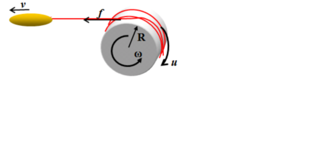
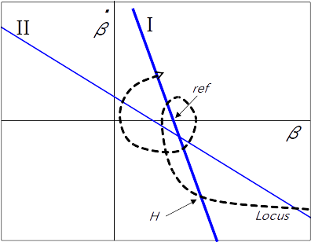

# SlidingMode
<!--
$$
\dot{\omega}=\frac{R}{J}f-\frac{1}{J}u
$$
## function Brk_CalcTotalBrk(void){

1. オブザーバ/張力推定器
---
  1. 技術解説  
  
張力はセンサー等ではなくスプールの回転速度からオブザーバで推定する。右図がこの力学系のモデル図である。この系の数式張モデルは下式となる。  
&nbsp;&nbsp;&nbsp;  
変数<i>u</i>はスプールに作用させるブレーキトルクである。これは制御系から見ると既知である。  
張力<i>f</i>の立式は困難であるが、定数と仮定  
&nbsp;&nbsp;&nbsp;  
すればオブザーバで推定可能(可観測)である。  
次にマイコンでの実装を容易にするため、以下の変数変換を行う。これはトルクを角加速度の次元に変換するものである。  
&nbsp;&nbsp;&nbsp;  
またブレーキトルクは発電制動によって得られるため、コイル電流と回転速度に比例する。さらにモータはコアレス構造のためインダクタンスが低く、電気時定数は100&micro;秒のオーダである。従ってコイル電流は印加電圧、つまりPWMデューティと比例すると見なせる(オームの法則)。以上を考慮すると、ブレーキトルクとデューティは以下の比例関係にある。  
&nbsp;&nbsp;&nbsp;  
<i>b</i>はブレーキ定数と呼ぶ。式の見かけ上、これはこの系の時定数の逆数となる。これはトルク定数とコイルインピーダンスなどから求められるが、最終的には較正が必要である。較正手段は後述する。  
以上を考慮した系の数式モデルは下式となる。  
&nbsp;&nbsp;&nbsp;  
&nbsp;&nbsp;&nbsp;  
この系に対する、同一次元オブザーバは下式となる。ただしオブザーバの極配置は、実数部-&lambda;、虚数部０の重極とする。  
&nbsp;&nbsp;&nbsp;  
&nbsp;&nbsp;&nbsp;  
実装上、サンプリングは定周期ではなく、1回転ごととなる。よって上式を&Delta;&theta;にて離散化することでマイコンで解くモデルを得る。
  
  2. コード解説  
以下のコードは、先のオブザーバモデルの数値解析部である。CPUの制約(8ビット)から、固定小数点演算にて処理する必要があり、固定小数点設計ツール https://github.com/KazukiHiraizumi/FixPointDesigner を使って設計している。

~~~
//observer
	if(wh==0){
		wh=(pi2/dt)<<4;
		wrps=wh>>11;
		werr=0;
		pole=PRM_ReadData(M_PRM_ID_CMN_POL);
		b2pi=PRM_ReadData(M_PRM_ID_UNQ_ZPOS);
		b2pc=b2pi<<8;
	}
	else{
		u16 pold=((u16)PRM_ReadData(M_PRM_ID_CMN_POLD)<<8)/(dt>>4);
		u16 pol=pold<pole? pold:pole;
		u8 h1=pol;
		u8 h2=(pol*pol)>>7;
		werr=(pi2-((wh>>4)*dt))>>7;
		wh=wh+((werr*h1)>>8)+(((bh>>6)*dt)>>12)-((b2pi*duty)<<1);
		bh=bh+(dbh=(werr*h2)>>4);
	}
~~~
  定数
<table>
<tr><th>variable<td>pi2<td>pole<td>b2pi</tr>
<tr><th>description<td>2&pi;<td>サンプリング時間<td>角速度<td>角速度(小数部切捨て)<td>&omega;推定誤差<td>極<td><i>b&times;2&pi;</i><td>b補正(後述)</tr>
<tr><th>bit width</tr>
<tr><th>decimal point</tr>
</table>
  変数
<table>
<tr><th>variable<td>dt<td>wh<td>bh<td>wrps<td>werr<td>dbh</tr>
<tr><th>description<td>2&pi;<td>サンプリング時間<td>角速度<td>角速度(小数部切捨て)<td>&omega;推定誤差<td>極<td><i>b&times;2&pi;</i><td>b補正(後述)</tr>
<tr><th>bit width</tr>
<tr><th>decimal point</tr>
</table>
PRM_ReadDataは引数のアドレスにあるROMデータを参照する。戻り値は8ビット(0..255)である。  
~~~
	if(wh==0){
~~~
このブロックは最初のサンプリングで1回だけ処理される。変数の初期化が行われる。  
b2pc はゼロ点補正部(ゼロ点のズレを修正)での使用のためROM値で初期化する
~~~
	else{
~~~
このブロックは毎サンプリング(1回転ごと)に処理される。先の離散化オブザーバの数値計算を行う。  
この計算途中の dbh は&beta;の微分として利用されるが、&Delta;tが乗じられていることを忘れないように。&beta;の微分とするには&Delta;tで除すること。

2. スライディングモード制御
---
  1. 技術解説
  
右図は、位相平面内の張力のローカスをイメージしたものである。スライディングモード制御は状態変数(張力と張力微分)の位相平面内の位置が、切替面(青線)の左右のどちらにあるかで、制御入力(PWMデューティ)を切り替える制御である。  
つまり、切替面から離れた位置では、系の閉ループゲインが０に対し、切替面近傍では∞のゲインを持つ。これにより不安定な系を安定化させる手法である。  
  1. コード解説
~~~
//sliding mode function
	if(hflag){
		u16 D=hflag<3? PRM_ReadData(M_PRM_ID_UNQ_UD6):PRM_ReadData(M_PRM_ID_UNQ_UD5);
		s32 ref=(s32)(hflag<3? PRM_ReadData(M_PRM_ID_UNQ_UD4):readTbl(M_PRM_ID_UNQ_UD8,t10ms))<<bhpnt;
		s32 sig=((bh-ref)>>9)*D+(dbh<<11)/dt;
		switch(hflag){
		case 1:
			hvalue=0;
			if(tmsec<20) break;
			hflag=2;
			break;
		case 2:
		case 3:
			hvalue=0;
			if(sig>0) break;
			hvalue=1;
			hflag=3;
			break;
		}
	}
~~~

#include <cmn.h>
#include <prm.h>
#include <comm.h>
#include <spl_cnt.h>
#include <tm.h>
#include <pwm_cfg.h>

#include <state_cast_cmn.h>

//elapsed time
static u32 time;
//observer vars
static s32 wh,bh,werr;
static s32 pi2,b2pi;
static s16 duty;
static u8 pole;
static u16 b2pc; //zero correction
//watches_
static s32 bwat; //decimal point admjusted bh
static u32 wrps;//ang.velocity by rad/s
static u16 wrmax;//max ang.velocity by rad/s
static u8 wovrd; //velocity override
static u16 zovrd; //zero point override
static u16 revs;

//sliding mode
static u8 hflag;
static u8 hvalue; //output
//amplitude feedback
static u8 jflag;
static u32 jvar;
static u16 jvalue;
static u16 jtmr;
//brake table
static u8 iflag;
static u16 ivalue; //duty
//steady control
static u8 sflag;
static u16 stmr1,stmr2;

#define	US2MS(s) ((s)>>10)
#define	MS2US(s) ((s)<<10)
#define	DIV10(s) (((s)*3)>>5)
#define	ODD(s) ((s)&1)
#define	MAX(a,b) ((a)>(b)? a:b)
#define	MIN(a,b) ((a)<(b)? a:b)

static u8 flagTbl;
static u16 interp(int y1,int y2,int dx,int w){
	return ((long)y2*w+(long)y1*(dx-w))/dx;
}
static u16 readTbl(int p,int w){
	u8 x1=PRM_ReadData(p);
	u8 x2=PRM_ReadData(p+2);
	u8 y1,y2;
	if(w<0) w=0;
	if(w>255) w=255;
	while(x2<w){
		x1=x2;
		p+=2;
		x2=PRM_ReadData(p+2);
	}
	y1=PRM_ReadData(p+1);
	y2=PRM_ReadData(p+3);
	return interp(y1,y2,x2-x1,w-x1);
}
void BrkVoid_func(Brk_Ctx_t * const p_this){}

void Brk_Init(void){
	wh=bh=time=wrmax=revs=0;
	hflag=jflag=iflag=sflag=1;
	pi2=(6L<<27)+(2L<<27)/10+(8L<<27)/100;	//6.28
	zovrd=256;
}

u8 Brk_CalcTotalBrk(void){
	u8 bhpnt=PRM_ReadData(M_PRM_ID_CMN_BPNT) +9;
	u16 dt=SPL_CNT_GetCnt();//as micro sec
	u16 tmsec,t10ms; //elapsed time by msec
	s32 dbh;
	u8 rev10;
	Comm_Cmd_Data_t	data;

	if(dt==0) return duty;
	tmsec=US2MS(time+=dt);
	t10ms=DIV10(tmsec);
	revs++;
	rev10=DIV10(revs);
//observer
	if(wh==0){
		wh=(pi2/dt)<<4;
		wrps=wh>>11;
		werr=0;
		pole=PRM_ReadData(M_PRM_ID_CMN_POL);
		b2pi=PRM_ReadData(M_PRM_ID_UNQ_ZPOS);
		b2pc=b2pi<<8;
	}
	else{
		u16 pold=((u16)PRM_ReadData(M_PRM_ID_CMN_POLD)<<8)/(dt>>4);
		u16 pol=pold<pole? pold:pole;
		u8 h1=pol;
		u8 h2=(pol*pol)>>7;
		werr=(pi2-((wh>>4)*dt))>>7;
		wh=wh+((werr*h1)>>8)+(((bh>>6)*dt)>>12)-((b2pi*duty)<<1);
		bh=bh+(dbh=(werr*h2)>>4);
	}
//output filter
	bwat=bh>>bhpnt;
	wrps=wh>>11;
	if(wrmax<wrps){
		wrmax=wrps;
		wovrd=readTbl(M_PRM_ID_UNQ_DX0,DIV10(wrmax));
	}
//zero point auto correction
	if(b2pc>0){
		if(bwat<0){
			u8 zp=PRM_ReadData(M_PRM_ID_UNQ_ZPOS);
			u8 zc=PRM_ReadData(M_PRM_ID_UNQ_UD2);
			b2pc-=(bwat*PRM_ReadData(M_PRM_ID_UNQ_ZCMP)*dt)>>10;
			b2pi=b2pc>>8;
			zovrd=((u16)zp<<8)/((((u16)zp*(255-zc)+b2pi*zc))>>8);
		}
		if(t10ms>PRM_ReadData(M_PRM_ID_UNQ_UD3)){
			data.ary[0]=data.ary[1]=data.ary[2]=0;
			data.ary[3]=b2pi;
			COMM_AddSndBuf(APP_TM_GetExeTime(),M_COMM_DEBUG_DATA_RCV_CMD,&data);
			data.ary[0]=data.ary[1]=0;
			data.ary[2]=zovrd>>8;
			data.ary[3]=zovrd;
			COMM_AddSndBuf(APP_TM_GetExeTime(),M_COMM_DEBUG_DATA_RCV_CMD,&data);
			b2pc=0;
		}
	}
//sliding mode function
	if(hflag){
		u16 D=hflag<3? PRM_ReadData(M_PRM_ID_UNQ_UD6):PRM_ReadData(M_PRM_ID_UNQ_UD5);
		s32 ref=(s32)(hflag<3? PRM_ReadData(M_PRM_ID_UNQ_UD4):readTbl(M_PRM_ID_UNQ_UD8,t10ms))<<bhpnt;
		s32 sig=((bh-ref)>>9)*D+(dbh<<11)/dt;
		switch(hflag){
		case 1:
			hvalue=0;
			if(tmsec<20) break;
			hflag=2;
			break;
		case 2:
		case 3:
			hvalue=0;
			if(sig>0) break;
			hvalue=1;
			hflag=3;
			break;
		}
	}
//brake table
	if(iflag){
		ivalue=(readTbl(M_PRM_ID_UNQ_BX0,rev10)*wovrd)>>8;
	}
//amplitude feedback
	if(jflag){
		switch(jflag){
		case 1:
			jvar=ivalue<<8;
			if(t10ms<PRM_ReadData(M_PRM_ID_UNQ_UD20)) break;
			jflag=2;
			break;
		case 2:
			if(bwat<0) break;
			jvar-=((((u32)readTbl(M_PRM_ID_UNQ_EX0,bwat)*dt)>>8)*(jvar>>8))>>8;
			break;
		}
		jvalue=jvar>>8;
		if(jvalue>ivalue) jvar=(jvalue=ivalue)<<8;
	}
//input select
	if(sflag){
		u8 lo=PRM_ReadData(M_PRM_ID_UNQ_UD16);
		duty=(jvalue*zovrd)>>8;
		switch(sflag){
		case 1:
			lo=PRM_ReadData(M_PRM_ID_UNQ_UD17);
			if(hvalue) sflag=2;
			break;
		case 2:
			if(tmsec>500){
				if(PRM_ReadData(M_PRM_ID_UNQ_UD19)>0) stmr1=tmsec;
				else stmr1=10000;
				sflag=3;
			}
			break;
		case 3:
			if(tmsec>stmr1){
				int t2=PRM_ReadData(M_PRM_ID_UNQ_UD19);
				if(t2<100){
					stmr2=tmsec+t2;
				}
				else{
					stmr2=tmsec+(t2-100);
				}
				sflag=4;
			}
			break;
		case 4:
			if(PRM_ReadData(M_PRM_ID_UNQ_UD19)<100){
				duty=lo=PRM_ReadData(M_PRM_ID_CMN_PWM_LV_MAX);
			}
			else{
				duty=lo=PRM_ReadData(M_PRM_ID_CMN_PWM_LV_MIN);
			}
			if(tmsec>stmr2){
				stmr1=tmsec+10*(u16)PRM_ReadData(M_PRM_ID_UNQ_UD18);
				sflag=3;
			}
			break;
		}
		if(!hvalue && duty>lo) duty=lo;
	}
	return duty;
}

s16 Brk_GetTension(void){
	return bwat;
}

u8 Brk_GetFlag(void){
	u8 watn=PRM_ReadData(M_PRM_ID_CMN_MON);
	u8 bhpnt=PRM_ReadData(M_PRM_ID_CMN_BPNT) +9;
	switch(watn){
	case 1:
		return hvalue;
	case 2:
		return ivalue>>1;
	}
	return 0;
}
-->
